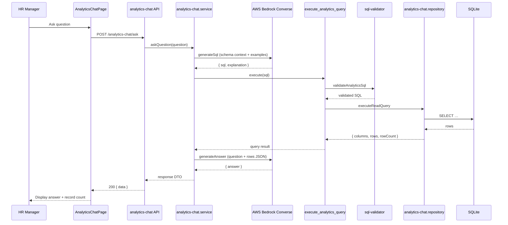

# Salary Analytics Chat — Feature Guide

Optional stretch feature that lets an HR Manager ask **natural-language questions** about employee and compensation data. Answers are **grounded in SQLite query results** — the LLM never receives direct database access.

**Related documents**

| Document | Purpose |
| -------- | ------- |
| [ACME system architecture (AWS)](./ACME_Salary_Management.drawio.png) | Full platform diagram including AI analytics on Bedrock |
| [ADR 001 — Text-to-SQL via AWS Bedrock](./adr/001-analytics-chat-bedrock-text-to-sql.md) | Architecture decisions and alternatives |
| [Analytics chat flow (draw.io)](./diagrams/salary-analytics-chat.drawio) | MVP feature-level sequence (open in [draw.io](https://app.diagrams.net)) |
| [backend-flow.md](./backend-flow.md) | General backend layout |
| [ai-usage.md](./ai-usage.md) | How AI tooling was used to build the project |

---

## Overview

| Item | Detail |
| ---- | ------ |
| **UI route** | `/analytics-chat` (sidebar: **Analytics Chat**) |
| **API** | `POST /api/v1/analytics-chat/ask` (authenticated) |
| **LLM provider** | AWS Bedrock **Converse API** (`@aws-sdk/client-bedrock-runtime`) |
| **Database** | Same SQLite DB as MVP — no duplicate AI tables, no RAG |
| **Optional** | Feature disabled when `AWS_REGION` / `BEDROCK_MODEL_ID` are unset → `503 LLM_NOT_CONFIGURED` |

---

## End-to-end flow

```
1. HR Manager types a question in Analytics Chat UI
2. Frontend POST /api/v1/analytics-chat/ask { question }  (Bearer token)
3. Controller validates question (non-empty, ≤ 500 chars)
4. Analytics Service → Bedrock: generate SQL + explanation (JSON)
5. execute_analytics_query tool:
     a. sql-validator.js — read-only checks, table allowlist, row limit
     b. analytics-chat.repository.js — runs validated SELECT on SQLite
6. On DB execution error only: up to 2 LLM correction attempts (see Retry strategy)
7. Analytics Service → Bedrock: generate final answer from query rows only
8. API returns { answer, sql, explanation, recordCount }
9. UI shows answer; optional "View query" reveals SQL for demo/debug
```

### Sequence (happy path)



---

## Tech stack

| Layer | Technology |
| ----- | ---------- |
| Frontend | React, `useAnalyticsChat` hook, `AnalyticsChatPage` |
| HTTP | Existing `sendJson` + Bearer auth |
| Backend | Express feature slice `features/analytics-chat/` |
| LLM | AWS Bedrock Converse (`BedrockRuntimeClient`, `ConverseCommand`) |
| AWS SDK | `@aws-sdk/client-bedrock-runtime` |
| Database | SQLite via existing `createDb()` adapter |
| Tests | Node `node:test` + Supertest; LLM **mocked** in all automated tests |

### Backend file map

```
backend/src/features/analytics-chat/
├── analytics-chat.routes.js       # POST /ask + authenticate
├── analytics-chat.controller.js
├── analytics-chat.service.js      # Orchestration + retry loop
├── analytics-chat.repository.js   # Only layer that runs SQL
├── analytics-chat.validator.js
├── analytics-chat.constants.js    # Limits, errors, table allowlist
├── analytics-schema.context.js    # Prompt schema + few-shot examples
├── sql-validator.js               # Deterministic SQL gate
├── execute-analytics-query.tool.js
├── llm-client.js                  # Bedrock Converse wrapper
├── llm-response.parser.js         # JSON extraction from LLM text
└── bedrock-model.js               # Nova 2 inference profile resolution
```

---

## LLM integration (AWS Bedrock)

### Configuration

| Variable | Required | Description |
| -------- | -------- | ----------- |
| `AWS_REGION` | Yes | e.g. `us-east-1` |
| `BEDROCK_MODEL_ID` | Yes | Model or **inference profile** ID |
| `AWS_ACCESS_KEY_ID` | Dev / non-AWS host | IAM access key (or use `aws configure`) |
| `AWS_SECRET_ACCESS_KEY` | Dev / non-AWS host | IAM secret |
| `BEDROCK_TIMEOUT_MS` | No | Default `30000` |

### Recommended models

| Model | `BEDROCK_MODEL_ID` | Notes |
| ----- | ------------------ | ----- |
| Nova 2 Lite | `us.amazon.nova-2-lite-v1:0` | Requires geo inference profile in US regions |
| Nova 1 Lite | `amazon.nova-lite-v1:0` | Direct model ID works in many regions |
| Claude 3 Haiku | `anthropic.claude-3-haiku-20240307-v1:0` | Enable in Bedrock Model access |

**Nova 2 note:** Raw ID `amazon.nova-2-lite-v1:0` is auto-mapped to `us.amazon.nova-2-lite-v1:0` when `AWS_REGION` is a US region (`bedrock-model.js`).

### Three LLM calls per successful question

1. **SQL generation** — prompt includes compact schema, business definitions, 2 few-shot examples; expects JSON `{ sql, explanation }`
2. **SQL correction** (conditional) — only after `ANALYTICS_QUERY_FAILED`; sends previous SQL + DB error message
3. **Answer generation** — prompt includes question, SQL, explanation, and **full query result JSON**; expects `{ answer }`

Temperature is **0** for deterministic SQL. The LLM is instructed to answer **only** from returned rows.

---

## Schema context (no RAG)

Schema is **small and stable** — embedded in `analytics-schema.context.js`, not retrieved via vector search.

**Tables exposed to analytics SQL**

- `employees`, `countries`, `departments`, `designations`, `employee_salaries`, `exchange_rates`

**Business definitions in prompts**

- Total compensation (local) = `base_salary + bonus + incentives`
- USD compensation = total compensation × `exchange_rates.rate_to_usd`
- Join pattern: `employee_salaries es` + `exchange_rates er` on `currency_code`

**Few-shot examples** (in prompts)

- Average compensation of engineers in India
- Employee count by department

---

## SQL validation

All LLM-generated SQL passes `validateAnalyticsSql()` **before** SQLite execution. Execution never bypasses the validator.

| Rule | Behavior |
| ---- | -------- |
| Statement type | Must start with `SELECT` |
| Forbidden keywords | Rejects INSERT, UPDATE, DELETE, DROP, ALTER, CREATE, ATTACH, PRAGMA, REPLACE, TRUNCATE, VACUUM, REINDEX |
| Multiple statements | Rejects `;`-separated batches |
| Table allowlist | Only 6 approved analytics tables |
| Row limit | Appends `LIMIT 500` if missing; rejects `LIMIT` > 500 |
| Comments stripped | `--` and `/* */` removed before checks |

Validation failures return **`422 ANALYTICS_SQL_INVALID`** — these do **not** trigger SQL correction retries (only database execution errors do).

---

## Retry algorithm and strategy

Implemented in `analytics-chat.service.js` → `runQueryWithCorrection()`.

| Setting | Value | Constant |
| ------- | ----- | -------- |
| Max correction attempts | **2** | `ANALYTICS_CHAT_LIMITS.maxSqlCorrectionAttempts` |
| Max executions per question | **3** (initial + 2 retries) | `attempt` loop `0..maxSqlCorrectionAttempts` |

### Algorithm

```
sql, explanation ← LLM.generateSql(question)

for attempt in 0 .. maxSqlCorrectionAttempts:
    try:
        result ← tool.execute(sql)     // validate then repository
        return { sql, explanation, result }
    catch error:
        if error.code ≠ ANALYTICS_QUERY_FAILED:
            throw immediately          // validation errors, etc.
        if attempt = maxSqlCorrectionAttempts:
            throw error                // stop infinite loops
        { sql, explanation } ← LLM.correctSql(question, sql, error.message)

// then generateAnswer from successful result
```

### What triggers retry vs fail-fast

| Error | Retry? | HTTP |
| ----- | ------ | ---- |
| Invalid SQL (validator) | No | 422 `ANALYTICS_SQL_INVALID` |
| DB error (bad column, syntax SQLite rejects after validation) | Yes, up to 2× | 422 `ANALYTICS_QUERY_FAILED` if exhausted |
| LLM timeout | No | 504 `ANALYTICS_LLM_TIMEOUT` |
| Bedrock / network failure | No | 502 `ANALYTICS_LLM_FAILED` |
| Feature not configured | No | 503 `LLM_NOT_CONFIGURED` |
| Empty query result | No retry | 200 with answer stating no matching data |

---

## Security model

```
┌─────────────┐     ┌──────────────┐     ┌─────────────────┐     ┌─────────┐
│   Bedrock   │ ──► │  JSON only   │     │  sql-validator  │ ──► │ SQLite  │
│  (no DB)    │     │  sql string  │     │  + repository   │     │ SELECT  │
└─────────────┘     └──────────────┘     └─────────────────┘     └─────────┘
```

- LLM **never** connects to SQLite
- No conversation persistence (no AI message tables)
- No write path to database from analytics feature
- Auth: same JWT/Bearer as rest of MVP
- AWS credentials in environment only — never committed

---

## API contract

**Request**

```http
POST /api/v1/analytics-chat/ask
Authorization: Bearer <token>
Content-Type: application/json

{ "question": "What is the average compensation of engineers in India?" }
```

**Success `200`**

```json
{
  "data": {
    "answer": "The average USD compensation for engineers in India is …",
    "sql": "SELECT AVG(…) … LIMIT 500",
    "explanation": "Average USD compensation for Engineering department in India",
    "recordCount": 1
  }
}
```

**Error codes**

| Code | Status | Meaning |
| ---- | ------ | ------- |
| `ANALYTICS_CHAT_VALIDATION_ERROR` | 400 | Empty or too-long question |
| `ANALYTICS_SQL_INVALID` | 422 | Failed validation gate |
| `ANALYTICS_QUERY_FAILED` | 422 | DB error after retries exhausted |
| `ANALYTICS_LLM_FAILED` | 502 | Bedrock error |
| `ANALYTICS_LLM_TIMEOUT` | 504 | Request exceeded timeout |
| `LLM_NOT_CONFIGURED` | 503 | Missing Bedrock env config |

---

## Demo script

### Prerequisites

1. Backend running with migrated + seeded DB (`npm run seed`)
2. Log in as HR user (e.g. dev login `mary.jackson@acme.example` / `password123` if `ALLOW_DEV_LOGIN=true`)
3. Bedrock model access enabled in AWS Console
4. `.env` configured:

```env
AWS_REGION=us-east-1
BEDROCK_MODEL_ID=us.amazon.nova-2-lite-v1:0
AWS_ACCESS_KEY_ID=…
AWS_SECRET_ACCESS_KEY=…
```

### Demo steps

1. Open **Analytics Chat** in the sidebar
2. Ask: *What is the average compensation of engineers in India?*
3. Wait for **Analyzing…** → read the natural-language answer and record count
4. Click **View query** → show generated SQL and explanation to the audience
5. Optional follow-ups:
   - *How many employees are in each department?*
   - *How many employees do we have?* (simple COUNT)
6. Show error handling: ask with Bedrock disabled → `503` message in UI

### Talking points for interview/demo

- Text-to-SQL with **validator sandbox** — not trust-the-LLM
- **Tool pattern** — LLM proposes, code executes
- **Grounded answers** — second LLM call sees only query JSON
- **Bounded retry** — correction uses DB error feedback, max 2 attempts
- **Optional feature** — core CRUD/dashboard work without AWS

---

## Testing and evaluation

### Automated tests (no live Bedrock)

| Test file | What it evaluates |
| --------- | ----------------- |
| `tests/unit/sql-validator.test.js` | Safe SELECT accepted; dangerous SQL rejected; LIMIT rules |
| `tests/unit/bedrock-model.test.js` | Nova 2 inference profile ID resolution |
| `tests/unit/llm-response.parser.test.js` | JSON parsing from fenced LLM output |
| `tests/unit/analytics-chat.repository.test.js` | USD compensation SQL against real SQLite |
| `tests/unit/execute-analytics-query.tool.test.js` | Tool validates before DB; structured results |
| `tests/unit/analytics-chat.service.test.js` | Full orchestration, retry once, empty results, 503 |
| `tests/unit/bedrock-llm-client.test.js` | Mock Bedrock client response mapping |
| `tests/analytics-chat.api.test.js` | HTTP auth, validation, success, 503 |

Run (Node 22+):

```bash
npm test -w backend
npm test -w frontend   # AnalyticsChatPage.test.jsx
```

### Manual evaluation checklist

| Scenario | Expected |
| -------- | -------- |
| Valid compensation question | Correct USD avg using FX rates |
| Department headcount | GROUP BY department, readable answer |
| No matching rows | Answer states data not found (not hallucinated numbers) |
| `DELETE FROM employees` in LLM output | Blocked by validator before DB |
| Wrong column name | 1–2 correction attempts, then 422 |
| Bedrock disabled | 503 in API and UI message |

---

## Limits and constants

| Limit | Value |
| ----- | ----- |
| Max question length | 500 characters |
| Max result rows | 500 (enforced on SQL) |
| Max SQL correction attempts | 2 |
| LLM timeout | 30 seconds (configurable) |
| Bedrock max tokens | 2048 per call |

---

## Dependencies added

| Package | Purpose |
| ------- | ------- |
| `@aws-sdk/client-bedrock-runtime` | Bedrock Converse API |

No OpenAI SDK. No vector DB. No additional frontend dependencies.
